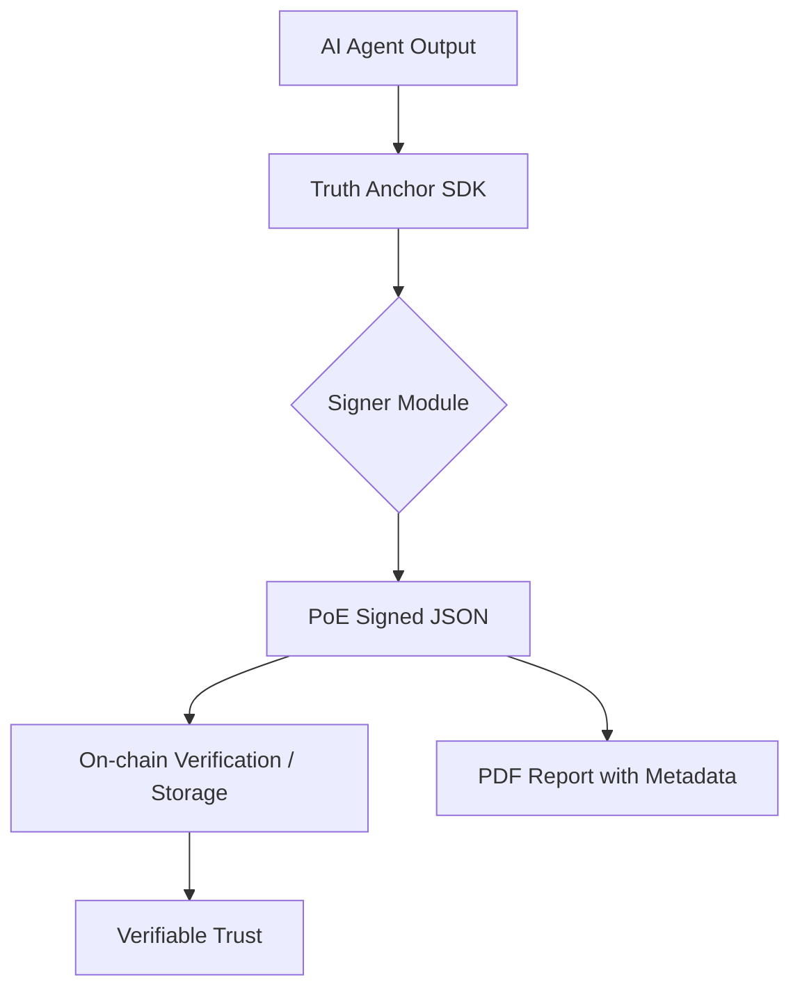

# Truth Anchor SDK (v0.2)

**The first decentralized SDK for verifiable AI decision-making on Ethereum.**

Truth Anchor SDK 是一個專為 Web3 時代設計的 AI 決策驗證工具包。它允許開發者為 AI 生成的報告、決策或數據提供不可篡改的鏈上/鏈下完整性證明（Proof of Equity/PoE），確保 AI 的輸出在去中心化環境中具備可信度。

---

## 🚀 Quick Start

### 1. 克隆與安裝
```bash
git clone https://github.com/truth-anchor-sdk/truth-anchor-sdk.git
cd truth-anchor-sdk
pip install flask web3 eth-account
```

### 2. 配置環境
複製 `.env.example` 並填入你的專用簽名私鑰：
```bash
cp .env.example .env
# 編輯 .env 填入 SIGNER_PRIVATE_KEY
```

### 3. 啟動服務
```bash
python main.py
```

---

## 🌟 Features

- **D-CVS (Decentralized Content Verification System)**: 基於 EIP-191 標準的去中心化內容驗證。
- **PoE (Proof of Equity) 報告簽名**: 為 AI 分析結果生成具備加密簽名的完整性證明。
- **確定性 JSON 處理**: 確保數據在傳輸與簽名過程中保持一致性。
- **輕量化 API**: 提供 `/sign-report` 與 `/verify-report` 接口，易於集成。
- **合規性設計**: 專為 2026 年 Web3 監管環境優化，專注於代碼理解與風險預警。

---

## 🏗️ Architecture



---

## 🔗 Live Demo

- **Dashboard**: [Coming Soon]
- **API Endpoint**: `http://localhost:8080` (Local Development)

---

## 📄 License

本項目採用 [MIT License](LICENSE)。

---

## ⚠️ Disclaimer

This tool is for code understanding and educational purposes only. Not financial advice, not an audit.
